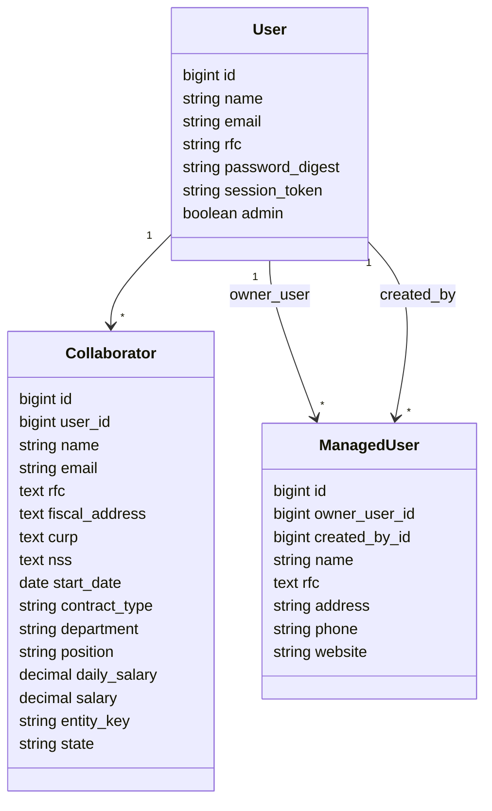

# Examen Tecnico Full Stack Ruby on Rails

Aplicacion web desarrollada con Ruby on Rails para cubrir un examen tecnico Full Stack. Incluye autenticacion propia, CRUD de colaboradores, CRUD de usuarios asociados, configuracion de cuenta, algoritmo de palindromos y consumo de JSONPlaceholder.

La guia rapida para ejecutar el proyecto esta en [COMO_CORRER.md](./COMO_CORRER.md).

## Stack Tecnico

- Ruby `3.3.11`
- Ruby on Rails `7.1.5`
- PostgreSQL `16`
- Active Record
- Active Record Encryption
- BCrypt con `has_secure_password`
- Hotwire, Turbo y Stimulus
- Bootstrap 5
- Faraday para consumo HTTP
- Docker con Ubuntu `24.04`

## Arquitectura

El proyecto usa una estructura Rails MVC tradicional:

- `app/models`: modelos, asociaciones, validaciones y cifrado.
- `app/controllers`: flujo de peticiones, autenticacion y autorizacion.
- `app/views`: vistas ERB con Bootstrap.
- `app/javascript/controllers`: controladores Stimulus.
- `app/services`: integraciones externas.
- `db/migrate`: versionado de estructura de base de datos.

No usa React, arquitectura hexagonal ni patrones complejos. La intencion es mantener una solucion clara, mantenible y facil de explicar.

## Modulos Funcionales

### Autenticacion

Controladores:

- `SessionsController`
- `RegistrationsController`
- `PasswordsController`

Funcionalidades:

- Registro de usuario.
- Inicio de sesion.
- Cierre de sesion.
- Recuperacion/actualizacion de password por correo y RFC.
- Restriccion de sesiones multiples mediante `session_token`.

La autenticacion se basa en:

- `has_secure_password`
- `bcrypt`
- `session[:user_id]`
- `session[:session_token]`

### Dashboard

Controlador:

- `DashboardController`

Muestra informacion general del usuario autenticado, incluyendo conteo de colaboradores y usuarios asociados.

### Colaboradores

Controlador:

- `CollaboratorsController`

Modelo:

- `Collaborator`

Permite crear, listar, consultar, editar y eliminar colaboradores asociados al usuario autenticado.

Campos sensibles cifrados:

- `rfc`
- `fiscal_address`
- `curp`
- `nss`

### Usuarios Asociados

Controlador:

- `ManagedUsersController`

Modelo:

- `ManagedUser`

Cada usuario asociado pertenece al usuario que lo creo. El RFC se almacena cifrado.

### Configuracion De Cuenta

Controlador:

- `AccountSettingsController`

Permite:

- Ver informacion del usuario.
- Editar nombre, correo y RFC.
- Cambiar password solicitando password actual.

### Algoritmos

Controlador:

- `AlgorithmsController`

JavaScript:

- `app/javascript/controllers/palindrome_controller.js`

Permite evaluar varias palabras al mismo tiempo para identificar si son palindromas. Ignora espacios y mayusculas/minusculas.

### Servicios JSONPlaceholder

Controlador:

- `ServicesController`

Servicio:

- `JsonPlaceholderService`

Consume:

- `GET https://jsonplaceholder.typicode.com/posts`
- `POST https://jsonplaceholder.typicode.com/posts`
- `PATCH https://jsonplaceholder.typicode.com/posts/:id`
- `DELETE https://jsonplaceholder.typicode.com/posts/:id`

JSONPlaceholder no persiste cambios reales. Para este proyecto, los cambios simulados se guardan temporalmente en sesion:

- `created_posts`
- `edited_posts`
- `deleted_post_ids`

Esto permite que crear, editar y eliminar se refleje en pantalla durante la sesion actual.

## Modelo De Datos

### `users`

Campos principales:

- `name`
- `email`
- `rfc`
- `password_digest`
- `session_token`
- `admin`

Indices:

- `email`, unico
- `rfc`, unico
- `session_token`

### `collaborators`

Pertenece a:

- `user`

Campos principales:

- `name`
- `email`
- `rfc`
- `fiscal_address`
- `curp`
- `nss`
- `start_date`
- `contract_type`
- `department`
- `position`
- `daily_salary`
- `salary`
- `entity_key`
- `state`

### `managed_users`

Pertenece a:

- `owner_user`
- `created_by`

Campos principales:

- `name`
- `rfc`
- `address`
- `phone`
- `website`

## Diagrama UML



## Rutas Principales

| Ruta | Metodo | Descripcion |
| --- | --- | --- |
| `/` | GET | Dashboard |
| `/registro` | GET/POST | Registro |
| `/login` | GET/POST | Inicio de sesion |
| `/logout` | DELETE | Cierre de sesion |
| `/password/recuperar` | GET/POST | Actualizacion de password |
| `/colaboradores` | CRUD | Colaboradores |
| `/usuarios` | CRUD | Usuarios asociados |
| `/configuracion-cuenta` | GET/PATCH | Configuracion de cuenta |
| `/algoritmos` | GET | Palindromos |
| `/servicios` | GET/POST/PATCH/DELETE | JSONPlaceholder |
| `/up` | GET | Health check |

## Seguridad

Medidas implementadas:

- Passwords con BCrypt mediante `has_secure_password`.
- Validaciones backend en modelos.
- Validaciones frontend con Stimulus para campos requeridos.
- Proteccion de rutas con `before_action :require_login`.
- Helper `current_user`.
- Busqueda de registros siempre desde `current_user`.
- Token de sesion para invalidar sesiones anteriores.
- Cifrado de datos sensibles con Active Record Encryption.

## Active Record Encryption

Configuracion:

- `config/initializers/active_record_encryption.rb`

Variables usadas:

- `ACTIVE_RECORD_ENCRYPTION_PRIMARY_KEY`
- `ACTIVE_RECORD_ENCRYPTION_DETERMINISTIC_KEY`
- `ACTIVE_RECORD_ENCRYPTION_KEY_DERIVATION_SALT`

En Docker se definen valores de desarrollo dentro de `docker-compose.yml`.

## JavaScript

Controladores Stimulus:

- `sidebar_controller.js`: muestra/oculta el menu lateral.
- `form_validation_controller.js`: marca campos vacios y passwords que no coinciden.
- `palindrome_controller.js`: evalua palindromos sin recargar la pagina.

## Docker

El proyecto incluye:

- `Dockerfile`
- `docker-compose.yml`
- `docker/entrypoint.sh`

El contenedor web usa Ubuntu `24.04`, compila Ruby `3.3.11` e instala dependencias nativas para Rails y PostgreSQL.

Servicios:

- `web`: aplicacion Rails.
- `db`: PostgreSQL 16.

Puertos:

- Rails: `localhost:3000`
- PostgreSQL desde Windows: `localhost:5433`
- PostgreSQL interno en Docker: `db:5432`

Comando principal:

```bash
docker compose up --build
```

## Variables De Entorno

Base de datos:

- `POSTGRES_HOST`
- `POSTGRES_PORT`
- `POSTGRES_USER`
- `POSTGRES_PASSWORD`
- `POSTGRES_DB`
- `DATABASE_URL` para produccion

Cifrado:

- `ACTIVE_RECORD_ENCRYPTION_PRIMARY_KEY`
- `ACTIVE_RECORD_ENCRYPTION_DETERMINISTIC_KEY`
- `ACTIVE_RECORD_ENCRYPTION_KEY_DERIVATION_SALT`

Rails:

- `RAILS_ENV`
- `SECRET_KEY_BASE` en produccion

## Usuario Demo

El archivo `db/seeds.rb` crea:

```text
Correo: demo@example.com
Password: Password123
RFC: XAXX010101000
```

## Archivos Relevantes

- `COMO_CORRER.md`: guia de ejecucion local y Docker.
- `Dockerfile`: imagen Linux Ubuntu para Rails.
- `docker-compose.yml`: servicios web y base de datos.
- `db/schema.sql`: script SQL de referencia.
- `db/migrate`: migraciones oficiales de Rails.
- `app/services/json_placeholder_service.rb`: cliente HTTP externo.

## Notas De Implementacion

- JSONPlaceholder simula operaciones y no persiste cambios reales.
- Los datos sensibles se guardan cifrados mediante Active Record Encryption.
- La sesion multiple se restringe rotando `session_token` al iniciar sesion.
- Docker es la forma recomendada en Windows para evitar diferencias entre entorno local y Linux.

